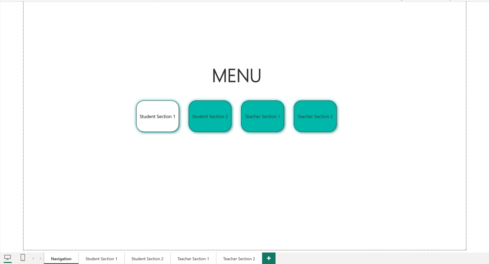
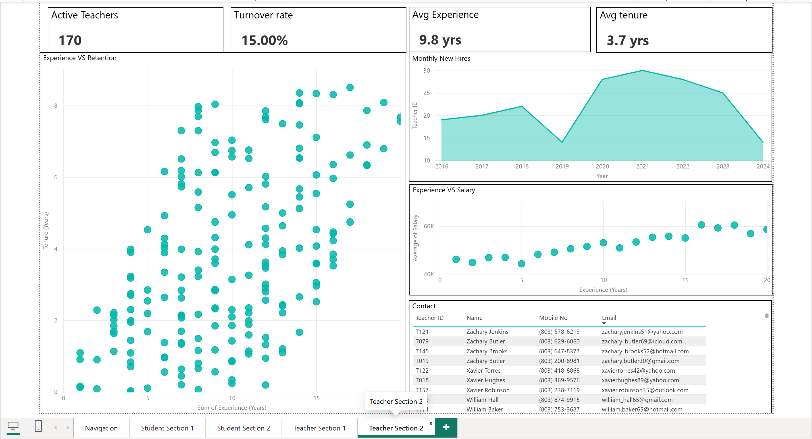

# End-to-End Power BI Dashboard — Operations, Retention & Financial KPI Analytics

**A five-page Power BI report covering student operations and staff/workforce analytics for a Columbia, SC school district — built to demonstrate data modeling, DAX, and dashboard-UX patterns that transfer directly to finance, marketing, healthcare, and HR analytics.**


---

## Overview

This project is an end-to-end analytics report for an educational institution (a Columbia, SC school district of ~3,000 students and 200 staff), built in Power BI on a fully synthetic dataset; no real personal data. It opens on a navigation menu and branches into four themed dashboards, two for students, two for staff, using button-driven page navigation, the way a multi-entity report lets an analyst jump between business units.

The reason it sits in my portfolio isn't the school context; it's the analytical patterns. Attrition and retention, receivables aging, payroll distribution, performance scorecards, demographic segmentation, threshold-based exception lists, and executive KPI strips are the same problems finance, marketing, healthcare, and operations teams solve every day. This README maps each pattern to its real-world equivalent so the transferable skill is explicit.

---

## Why this matters across sectors

The report solves an education problem, but every visual is a reusable analytical building block. Here is how each pattern translates:

| Pattern in this project | Finance | Marketing / Growth | Healthcare | HR / Operations |
|---|---|---|---|---|
| **Turnover rate + Active/Left status + tenure scatter** | Loan default & survival cohorts | Customer churn & retention curves | Patient drop-off, readmission risk | Employee attrition, tenure analysis |
| **KPI scorecard strip (count, rate, averages)** | Executive financial scorecard | Growth/funnel KPI header | Clinical ops dashboard header | Workforce KPI summary |
| **Fees collected vs. pending (gauge + class breakdown)** | A/R aging, DSO, collections | Subscription billing, MRR, dunning | Outstanding patient balances, claims | Vendor / invoice payment tracking |
| **Attendance % + sub-75% exception list** | SLA / covenant breach monitoring | Active-user & engagement thresholds | Appointment adherence, compliance | Shift coverage, attendance flags |
| **Performance matrix + top-N leaderboard** | Top revenue lines / accounts | Best-performing channels & campaigns | Provider utilization scorecards | Top performers by KPI |
| **Demographics (pie / donut / histogram)** | Client segmentation by tier | Persona & audience segmentation | Patient population & risk strata | Headcount by dept / seniority |
| **Navigation menu + multi-page drill** | Multi-entity / subsidiary reporting | Multi-brand or region switcher | Multi-clinic consolidated reporting | Business-unit consolidated reporting |

The takeaway for a reviewer: repoint the same model at a different fact table and it becomes a churn dashboard, an A/R-aging dashboard, or a workforce-analytics dashboard — no new techniques required.

---

## Skills demonstrated

- **Data modeling** — relational structure linking student and staff entities to date-based logic for multi-year trends.
- **DAX measures** — turnover and retention logic, `AVERAGEX` row-by-row aggregation, `DATEDIFF`/`COALESCE` tenure calculation, distinct-count fee measures, ratio and percentage measures, and conditional exception flags (the automated sub-75% attendance lists).
- **Report navigation** — a menu landing page with button-driven navigation across four dashboards (the consolidated multi-entity pattern).
- **Dashboard UX** — an executive KPI strip, deliberate visual hierarchy (the retention scatter as the focal chart), and demotion of low-value reference data (contact directory) to supporting panels.
- **Visual selection discipline** — matching chart to question: trend → area/line, composition → stacked/donut, distribution → histogram, single value → KPI card, relationship → scatter.
- **Data-quality rigor** — caught and fixed a misconfigured marks matrix (counting students instead of averaging marks), corrected a mislabeled "retention" chart that was plotting salary, and rebuilt the source data so headcount ratios, fee magnitudes, and locations were internally consistent.

---

## Report structure

Five pages: a navigation menu plus four dashboards reached from it.

### 1. Navigation (menu)
A landing page with buttons linking to each of the four dashboards.

### 2. Student Section 1 — Attendance, Demographics & Fees
- **Attendance** — average attendance by enrollment date (area), an automated follow-up table of students below 75%, class-wise attendance (bar).
- **Demographics** — total student count (card, 3,000), gender split (pie), scholarship vs. non-scholarship (donut).
- **Fee Management** — fees collected vs. total (gauge, ~$22M of ~$30M), monthly fee payments (area), class-wise fees paid vs. pending (stacked bar).

### 3. Student Section 2 — Academics, Admissions & Contacts
- **Academic Performance** — subject × grade average-marks matrix, class-wise average marks (bar), top performers by overall average (table).
- **Admissions** — monthly new admissions (area), class-wise admissions (column).
- **Parent & Contact** — emergency-contact slicer, parent contact table, searchable emergency-contact directory.

### 4. Teacher Section 1 — Attendance, Payroll & Demographics
- **Attendance** — attendance by joining date (area), sub-75% follow-up table, teacher-wise attendance (bar).
- **Salary & Payments** — average salary (gauge, ~$51.85K), department salary distribution across salary/bonus/advance (stacked bar), multi-year payroll trend (area).
- **Demographics** — total count (card, 200), count by department/subject (column), gender split (pie), experience distribution (histogram).

### 5. Teacher Section 2 — Hiring, Retention & Contacts
- **KPI strip** — Active Teachers (170), Turnover Rate (15%), Avg Experience (9.8 yrs), Avg Tenure (3.7 yrs).
- **Experience vs. Tenure** scatter — the retention focal chart (~200 individual teachers).
- **Yearly New Hires** (area, 2016–2024) and **Experience vs. Salary** (scatter).
- **Contact** — compact teacher directory.

---

## Key DAX measures

Turnover and retention are computed from a `Status` (Active/Left) field and an `Exit Date` on the staff table:

```DAX
Total Teachers = COUNTROWS('Teachers Section')

Active Teachers = CALCULATE([Total Teachers], 'Teachers Section'[Status] = "Active")

Teachers Left  = CALCULATE([Total Teachers], 'Teachers Section'[Status] = "Left")

Turnover Rate  = DIVIDE([Teachers Left], [Total Teachers], 0)

-- Per-teacher tenure (for the scatter; each point is one Teacher ID)
Tenure (Years) =
VAR AsOf  = DATE(2024, 7, 31)
RETURN
DIVIDE(
    DATEDIFF(
        MAX('Teachers Section'[Joining Date]),
        COALESCE(MAX('Teachers Section'[Exit Date]), AsOf),
        DAY
    ),
    365.0
)

-- Average tenure across all teachers (for the KPI card)
Avg Tenure (Years) =
AVERAGEX(
    'Teachers Section',
    VAR AsOf = DATE(2024, 7, 31)
    RETURN
    DIVIDE(
        DATEDIFF('Teachers Section'[Joining Date], COALESCE('Teachers Section'[Exit Date], AsOf), DAY),
        365.0
    )
)
```

The two tenure measures do different jobs: the `MAX`-based one returns a single teacher's value inside the scatter's per-point filter context, while the `AVERAGEX` version walks every teacher to produce the headline average for the card.

---

## Data model

The dataset is **synthetic and internally consistent**: ~3,000 students and 200 staff (a realistic ~15:1 ratio), all addresses in Columbia, SC, with 803 area-code phone numbers, dates of birth aligned to grade level, and per-student fees that sum to a coherent ~$30M total.

**Student entity (selected fields):** Student ID, Class/Grade, Section, Gender, Date of Birth, Enrollment Date, Fees Paid / Pending / Total, Attendance %, subject marks, Scholarship flag, and synthetic Columbia-area contact fields.

**Staff entity (selected fields):** Teacher ID, Department/Subject, Qualification, Experience (Years), Attendance %, Salary, Bonus, Advance Payment, Joining Date (spread across 2016–2024), **Exit Date**, and **Status (Active/Left)**.

> Contact and identity columns demonstrate directory and data-integrity patterns and are populated with fabricated values only.

### Turnover methodology note
The reported turnover (15%) is a **cumulative** rate — the share of the 2016–2024 roster that has left. The textbook HR metric is annualized (separations ÷ average headcount per period), which would use a dedicated date dimension. The cumulative version is a deliberate simplification appropriate to a single-snapshot portfolio dataset.

---

## Tech stack

- **Power BI Desktop** — modeling, DAX, visuals, button-based page navigation, KPI cards
- **Microsoft Excel** — source dataset
- **Power Query (M)** — data cleaning and transformation

---

## Repository structure

```
.
├── README.md
├── data/
│   └── College_Dashboard_Columbia_SC.xlsx   # synthetic source dataset
├── dashboard/
│   └── school_operations.pbix               # Power BI report file
└── screenshots/
    ├── navigation.png
    ├── student_section_1.png
    ├── student_section_2.png
    ├── teacher_section_1.png
    └── teacher_section_2.png
```

---

## Screenshots

> Add the exported page images to `/screenshots` and reference them here, e.g.:

```markdown


```

A short GIF clicking through the navigation menu into each dashboard is the single most effective thing to add — it shows the multi-page pattern at a glance.

---

## How to run

1. Clone the repository.
2. Open `dashboard/school_operations.pbix` in **Power BI Desktop**.
3. If prompted, repoint the data source to `data/College_Dashboard_Columbia_SC.xlsx`.
4. Use the navigation menu buttons (or the page tabs) to move between the four dashboards.

---

## Possible extensions

- Add a **date dimension** and time-intelligence measures (YoY, YTD) and convert turnover to a true annualized rate.
- Layer in **row-level security** to demonstrate role-based access (e.g., a department head sees only their staff).
- Repoint the model at a **sales, churn, or A/R-aging dataset** as a direct proof of cross-sector transferability.
- Publish to the Power BI Service with scheduled refresh.

---

## About

Built as a portfolio piece to demonstrate practical Power BI report development and — more importantly — analytical patterns that generalize across industries. Feedback and questions are welcome.
